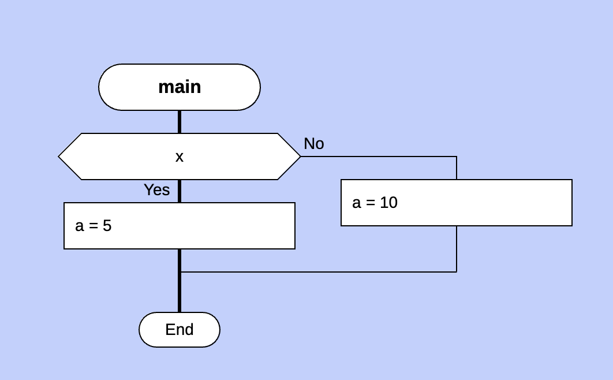

# Описание проекта

Даный проект позволяет из текстового представления R-схемы получать искомый код на языке Python. Также реализуется сравнительный анализ с генерацией кода на языке Дракон.
На первой итерации система позволяет генерироать алгоритмы, состоящие из управляющий конструкций: IF, FOR, WHILE.

## Пример генерации кода Python из R-схемы
<div style="display: flex; justify-content: center;">
<div style="margin-right: 20px;">

**R-схема:**

```
    x
o-------->o
|   a=5   |
|         |
|-------->|
    a=10
```

</div>
<div style="margin-right: 25px;">
        <b>Диаграмма Дракон:</b><br>
        
    </div>
<div style="margin-right: 20px;">

**Код на Python:**

```python
if x:
    a = 5
else:
    a = 10
```

</div>
</div>

