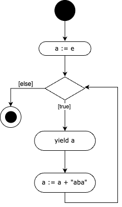
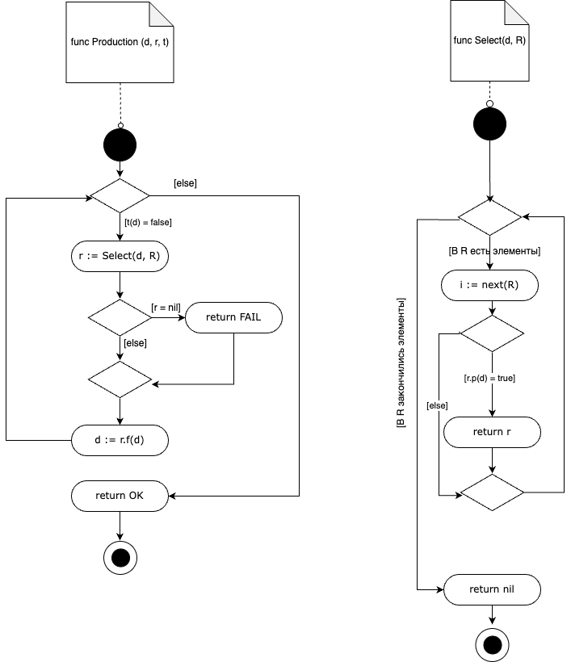

# Пример трансляции псевдокода в диаграмму деятельности

## DiaDel программа
````
    start = BC360
    action = CR4
    decision = WRH4
    merge = WRH4
    => = A2
    comment = WF5
    --> = DA2
    end = BWC360
````

## Пример 1

Псевдокод
````
    a := e
    while true do
        yield a
        a := a + "aba"
    end while
````

Экземпляр семантической модели
```
    start{id=1} => action{id=2, text="a :=e"}
    action{id=2, text="a :=e"} => decision{id=3}
    decision{id=3} =>{true} action{id=4, text="yield a"}
    action{id=4, text="yield a"} => action{id=5, text = 
    "a := a + 'aba'"}
    action{id=5, text = "a := a + 'aba'"} => decision{id=3}
    decision{id=3} =>{else} end{id=6}
```



## Пример 2

Псевдокод
````
func GCD(a, b)
  if b = 0 then
    res := a
  else
    res := GCD(b, a mod b)
  return res
````

Экземпляр семантической модели
```
    comment{id=1, text="func GCD(a, b)"} --> start{id=2}
    start{id=2} => decision{id=3}
    decision{id=3} =>{b=0} action{id=4, text="res := a"}
    decision{id=3} => {else} action{id=5, text="res := GCD 
    (b, a mod b)"}
    action{id=4, text="res := a"} => merge{id=6}
    action{id=5, text="res := GCD (b, a mod b)"} => merge
    {id=6}
    merge{id=6} => action{id=7, text="return res"}
    action{id=7, text="return res"} => end{id=8}
```


## Пример 3

Псевдокод
```
    func Select (d, R)
        for i in R do
            if r.p (d) = true then
                return r
            end if
        end for
        return nil
    end func
```

```
    func Production (d, R, t)
        while t(d) = false
            r := Select(d, R)
            if r = nil then 
                return FAIL
            end if
            d := r.f(d)
        end while
        return OK
    end func
```

Экземпляр семантической модели
```
    comment{id=1, text="func Select (d, R)"} --> start{id=2}
    start{id=2} => decision{id=3}
    decision{id=3} =->{There are elements in R} action{id=4, text="i := next(R)"}
    decision{id=3} =>{R has run out of elements} action{id=5, text="return nil"} 
    action{id=4, text="i := next(R)"} => decision{id=6}
    decision{id=6} =>{r.p(d) = true} action{id=7, 
    text="return r"}
    decision{id=6} =>{else} merge{id=8}
    action{id=7, text="return r"} => merge{id=8}
    merge{id=8} => decision{id=3}
    action{id=5, text="return nil"} => end{id=9}

    comment{id=10, text="func Production (d, R, t)"} -->
    start{id=11}
    start{id=11} => decision{id=12}
    decision{id=12} =>{b(d) = false} action{id=13, text="r 
    := Select(d, R)"}
    decision{id=12} =>{else} action{id=14, text="return OK"}
    action{id=13, text="r := Select(d, R)"} => 
    decision{id=15}
    decision{id=15} =>{r = nil} action{id=16, 
    text="return FAIL"}
    decision{id=15} =>{else} merge{id=17}
    action{id=16, text="return FAIL"} => merge{id=17}
    merge{id=17} => action{id=18, text="d := r.f(d)"}
    action{id=18, text="d := r.f(d)"} => decision{id=12}
    action{id=14, text="return OK"} => end{id=19}
```

