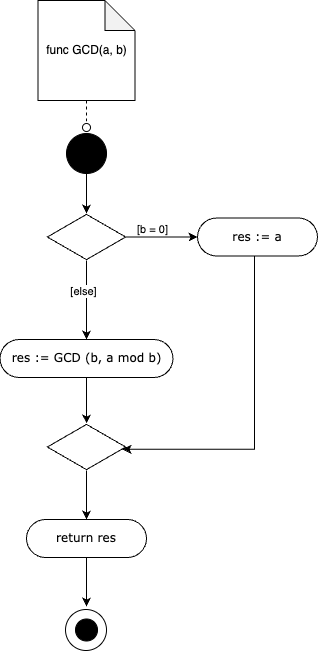

# Пример трансляции псевдокода в диаграмму деятельности

### Псевдокод
````
func(GCD, (a, b),
    if(b=0,
        (assign(res,a)),
        (assign(res,call(GCD, (b, a mod b))))
    ),
    return res
)
````

### Абстрактно-синтаксическое дерево (AST)


### Экземпляр семантической модели
```
    comment{id=1, text="func GCD(a, b)"} --> start{id=2}
    start{id=2} => decision{id=3}
    decision{id=3} =>{b=0} action{id=4, text="res := a"}
    decision{id=3} => {else} action{id=5, text="res := GCD 
    (b, a mod b)"}
    action{id=4, text="res := a"} => merge{id=6}
    action{id=5, text="res := GCD (b, a mod b)"} => merge
    {id=6}
    merge{id=6} => action{id=7, text="return res"}
    action{id=7, text="return res"} => end{id=8}
```

### Диаграмма деятельности


